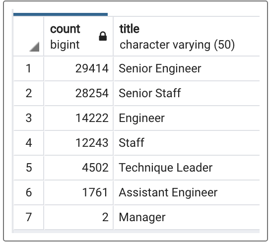
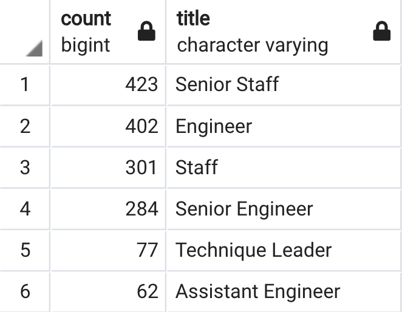
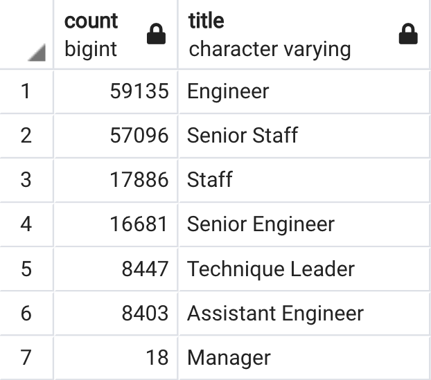

# Pewlett Hackard Analysis

## Overview

The following is an analysis of Pewlett Hackard employee data that attempts to address concerns over the eminent retirement of a large portion of the workforce. The first part of the analysis seeks to answer how many employees are likely to retire soon and what titles those employees hold. The second part of the analysis seeks to determine how many employees would be eligible to be mentors in a program aimed at using retirement-ready employees to train younger employees to fill positions left by retiring employees. 

## Results: 

### Retiring Employees by Title 

To determine the number and type of positions opening up due to retirement, job titles and other data were retrieved for employees born between January 1, 1952 and December 31, 1955. To determine the number of employees eligible to serve as mentors, job titles and other data was retrieved for employees born between January 1, 1965 and December 31, 1965. The results are as follows:
   * 90,398 positions will be opening due to retirement
   * The title with the most people retiring is Senior Engineer (29,414) with Senior Staff in second (28,254)
   * Three titles containing the word "Engineer" appeared in the search: Senior Engineer, Engineer, Assistant Engineer
   * Only two employees with the title of "Manager" are expected to retire

A breakdown of opening positions by title are shown in the chart below.

  

### Mentorship Eligibility

To determine the number of employees eligible to serve as mentors, job titles and other data was retrieved for employees born between January 1, 1965 and December 31, 1965. The results are as follows:
   * 1,549 employees are eligible to be mentors

## Summary: 

Based on the above parameters, an expected 90,398 positions will have to be filled while only 1,549 employees are eligible to become mentors. This problem is even more clear when eligible mentors are analyzed by title:



As shown above, even within this woefully inadequate employee subgroup, there is a proportionate lack of senior engineers, the title with the most retiring employees. 

### Proposed Solution

One way to bridge the gap between the number of open positions due to retirement and available mentors is to expand the eligibility of mentors. By expanding eligibility to employees born between 1956 (employees just before retirement age) and December 31, 1965, the number of possible mentors increases from 1,549 to 167,666. When counted by title, it can be seen that every title has enough possible mentors to match the number of employees lost to retirement. 



As shown above, by using these parameters for mentorship eligibility there are more than enough employees that can serve as mentors, and in fact this number can be further refined by continuing to alter the qualifying age limit for mentorship. The SQL queries used to provide this additional analysis are provided below: 
```
--Total Retiring Postions
SELECT COUNT(ut.emp_no)
FROM unique_titles as ut;

--Total Eligible Mentors
SELECT COUNT(me.emp_no)
FROM mentorship_eligibility as me

--Expanded Mentorship Eligibility
SELECT DISTINCT ON (e.emp_no)
	e.emp_no, 
	e.first_name,
	e.last_name,
	e.birth_date,
	de.from_date,
	de.to_date,
	tt.title
INTO expanded_mentorship_eligibility
FROM employees as e 
INNER JOIN dept_emp as de
ON (e.emp_no = de.emp_no)
INNER JOIN titles as tt
ON (e.emp_no = tt.emp_no)
WHERE (e.birth_date BETWEEN '1956-01-01' AND '1965-12-31')
	 AND (de.to_date = '9999-01-01')
ORDER BY e.emp_no ASC 

--Expanded Mentorship Total
SELECT COUNT(emp_no) 
FROM expanded_mentorship_eligibility;

--Expanded Mentorship by Title
SELECT COUNT(em.title), em.title
INTO expanded_mentorship_titles
FROM expanded_mentorship_eligibility as em
GROUP BY em.title
ORDER BY COUNT(em.title) DESC;
```
